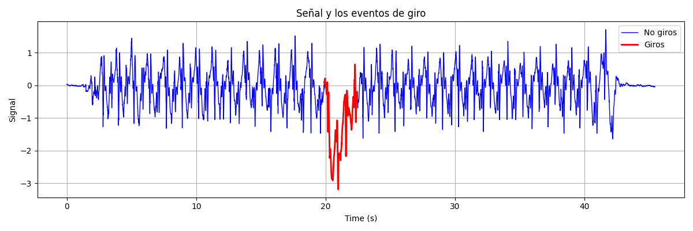

# SERETEST: CARACTERIZACIÓN DE GIROS

## CARACTERIZACIÓN DE LA POBLACIÓN SEGÚN SU FRANJA ETARIA

En principio, la intención es dividir a la población en cuatro categorías principales según su franja etaria: 0-45 años, 45-60 años, 60-75 años, mayor a 75 años.

   
  <strong>Figura:</strong> Gráfico de barras mostrando la distribución de los datos organizados por franja etaria, de todos los pacientes de los que se tiene información. No se cuentan con registros de todos los pacientes.

   
  <strong>Figura:</strong> Gráfico de barras mostrando la distribución de los datos organizados por franja etaria, de aquellos pacientes para los que se cuentan con registros en la base de datos

## DETECCIÓN DE GIROS

### DIAGRAMA DE FLUJO DEL ALGORITMO

   
  <strong>Figura:</strong> Diagrama de flujo que ilustra en alto nivel el proceso de alineación de la velocidad angular con un sistema inercial ENU/NED para luego calcular los giros.

### DESCRIPCIÓN ALGEBRAICA DEL ALGORITMO

Sea $\omega_{z}$ la velocidad angular (suavizada) en el eje vertical, $W$ la cantidad de muestras por ventana, $\theta_{0}$ un umbral de desplazamiento angualar, $N_{0}$ como la duración mínima de la ventana expresado en términos de muestras, pasados como parámetros de entrada. El algoritmo realiza una serie de iteraciones sobre las ventanas de modo que en la ventana $i$ se discretiza la integral para obtener la siguiente sumatoria:

$$
\Delta \theta_{i} = \sum_{k = i-W}^{i} \omega_{z}[k] \Delta t
$$

Si la señal tiene un total de $N$ muestras, entonces la iteración se realiza para $i = W, W + 1, ..., N$. El hecho de denotar $\Delta \theta_{i}$ como la sumatoria anterior no corresponde necesariamente al ángulo físico de giro en esa ventana, dado que no estoy integrando sólo la velocidad angular verdadera sino también el bias del giroscopio. 

El algoritmo de detección de giros se comporta de una manera similar a una máquina de estados que tiene dos estados {GIRO, NO GIRO} especificados de la siguiente manera:
- Si $|\Delta \theta_{i}| > \theta_{0}$ y no había sido detectado un giro, entonces el algoritmo detecta que en la ventana correspondiente pertenece a un giro y cambia de estado a GIRO.
- Si $|\Delta \theta_{i}| < \frac{\theta_{0}}{2}$ y había sido detectado un giro, entonces el algoritmo detecta la terminación de un giro y cambia de estado a NO GIRO. El giro se registra como válido únicamente en el caso de que su duración sea mayor al tiempo determinado por $N_{0}$ y si el desplazamiento angular total en el giro es mayor al umbral $\theta_{0}$.
- En otro caso, el algoritmo no cambia de estado.

### PRUEBAS SOBRE REGISTROS DE MARCHA

El sistema de referencia que estoy usando para calcular la orientación en estas pruebas es 'ENU' (East North Up).

   
  <strong>Figura:</strong> Gráfico de la componente vertical de la velocidad angular indicando con rojo los intervalos en los que se detectan giros. Registro <code>'MarchaEstandar_Rodrigo.txt'</code>

   
  <strong>Figura:</strong> Gráfico de la componente vertical de la velocidad angular indicando con rojo los intervalos en los que se detectan giros. Registro <code>'MarchaEstandar_Sabrina.txt'</code>

   
  <strong>Figura:</strong> Gráfico de la componente vertical de la velocidad angular indicando con rojo los intervalos en los que se detectan giros. Registro <code>'MarchaLibre_Rodrigo.txt'</code>

   
  <strong>Figura:</strong> Gráfico de la componente vertical de la velocidad angular indicando con rojo los intervalos en los que se detectan giros. Registro <code>'MarchaLibre_Sabrina.txt'</code>

