# SERETEST: CARACTERIZACIÓN DE GIROS

## CARACTERIZACIÓN DE LA POBLACIÓN SEGÚN SU FRANJA ETARIA

En principio, la intención es dividir a la población en cuatro categorías principales según su franja etaria: 0-45 años, 45-60 años, 60-75 años, mayor a 75 años.

  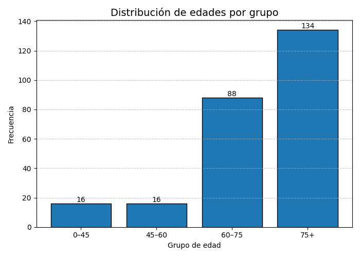 
  <strong>Figura:</strong> Gráfico de barras mostrando la distribución de los datos organizados por franja etaria, de todos los pacientes de los que se tiene información. No se cuentan con registros de todos los pacientes.

   
  <strong>Figura:</strong> Gráfico de barras mostrando la distribución de los datos organizados por franja etaria, de aquellos pacientes para los que se cuentan con registros en la base de datos

## CARACTERIZACIÓN DE LA POBLACIÓN SEGÚN EL NÚMERO DE CAÍDAS

Se visualizan las distribuciones del número de caídas de los pacientes dentro de cada uno de los rangos etarios. Para este análisis se contabilizan únicamente pacientes para los cuales se cuenta con registros en la base de datos.

  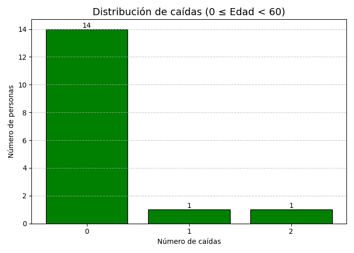 
  <strong>Figura:</strong> Gráfico de barras mostrando la distribución del número de caídas de los pacientes menores a 60 años

  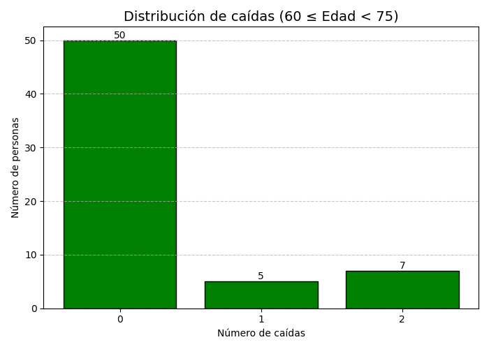 
  <strong>Figura:</strong> Gráfico de barras mostrando la distribución del número de caídas de los pacientes entre 60 y 75 años

  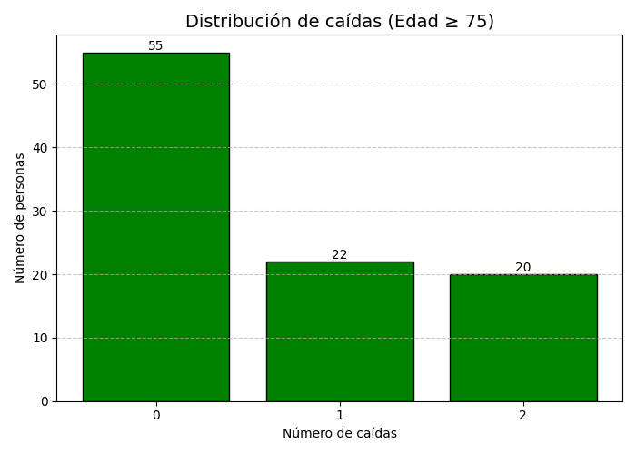 
  <strong>Figura:</strong> Gráfico de barras mostrando la distribución del número de caídas de los pacientes mayores a 75 años

## CARACTERIZACIÓN DE LA POBLACIÓN SEGÚN SI USAN O NO BASTÓN

Se visualizan las distribuciones de aquellos pacientes que usan o no usan bastón dentro de cada uno de los rangos etarios. Para este análisis se contabilizan únicamente pacientes para los cuales se cuenta con registros en la base de datos.

  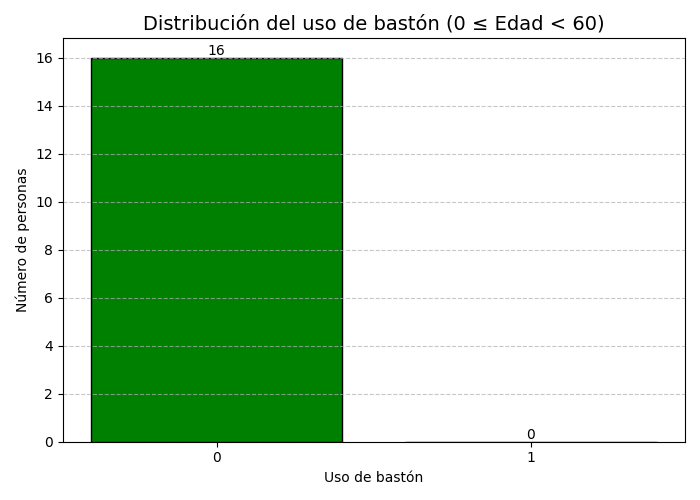 
  <strong>Figura:</strong> Gráfico de barras mostrando la cantidad de pacientes menores a 60 años que usan o no usan bastón. El indicador 0 es que las personas no usan bastón y 1 cuando las personas usan bastón

  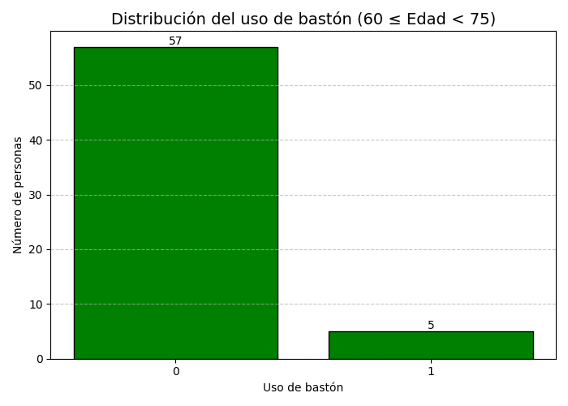 
  <strong>Figura:</strong> Gráfico de barras mostrando la cantidad de pacientes entre 60 y 75 años que usan o no usan bastón. El indicador 0 es que las personas no usan bastón y 1 cuando las personas usan bastón

  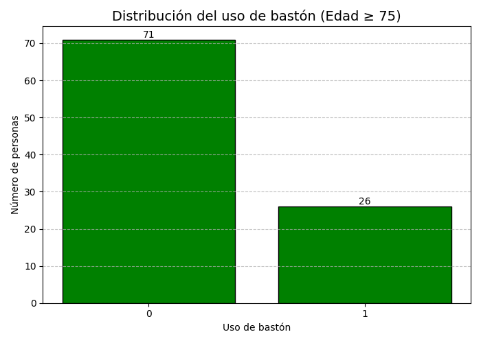 
  <strong>Figura:</strong> Gráfico de barras mostrando la cantidad de pacientes mayor a 75 años que usan o no usan bastón. El indicador 0 es que las personas no usan bastón y 1 cuando las personas usan bastón

## DETECCIÓN DE GIROS

### DIAGRAMA DE FLUJO DEL ALGORITMO

  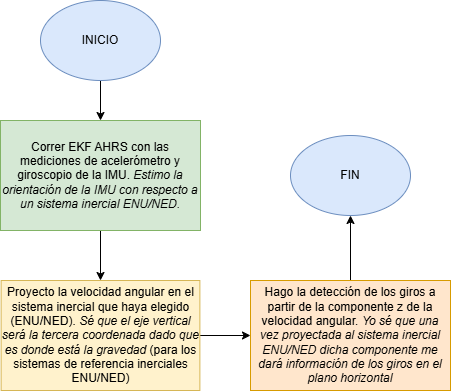 
  <strong>Figura:</strong> Diagrama de flujo que ilustra en alto nivel el proceso de alineación de la velocidad angular con un sistema inercial ENU/NED para luego calcular los giros.

### DESCRIPCIÓN ALGEBRAICA DEL ALGORITMO

Sea $\omega_{z}$ la velocidad angular (suavizada) en el eje vertical, $W$ la cantidad de muestras por ventana, $\theta_{0}$ un umbral de desplazamiento angular, $N_{0}$ como la duración mínima de la ventana expresado en términos de muestras. El algoritmo realiza una serie de iteraciones sobre las ventanas de modo que en la ventana $i$ se discretiza la integral para obtener la siguiente sumatoria:

$$
\Delta \theta_{i} = \sum_{k = i-W}^{i} \omega_{z}[k] \Delta t
$$

donde $\Delta t$ es el período de muestreo. Si la señal tiene un total de $N$ muestras, entonces la iteración se realiza para $i = W, W + 1, ..., N$. El hecho de denotar $\Delta \theta_{i}$ como la sumatoria anterior no corresponde necesariamente al ángulo físico de giro en esa ventana, dado que no estoy integrando sólo la velocidad angular verdadera sino también el bias del giroscopio (y términos de ruido adicionales).
El algoritmo de detección de giros se comporta de una manera similar a una máquina de estados que tiene dos estados {GIRO, NO GIRO} especificados de la siguiente manera:
- Si $|\Delta \theta_{i}| > \theta_{0}$ y no había sido detectado un giro, entonces el algoritmo detecta que en la ventana correspondiente pertenece a un giro y cambia de estado a GIRO.
- Si $|\Delta \theta_{i}| < \frac{\theta_{0}}{2}$ y había sido detectado un giro, entonces el algoritmo detecta la terminación de un giro y cambia de estado a NO GIRO. El giro se registra como válido únicamente en el caso de que su duración sea mayor al tiempo determinado por $N_{0}$ y si el desplazamiento angular total en el giro es mayor al umbral $\theta_{0}$.
- En otro caso, el algoritmo no cambia de estado.

### PRUEBAS SOBRE REGISTROS DE MARCHA

El sistema de referencia que estoy usando para calcular la orientación en estas pruebas es 'ENU' (East North Up).

  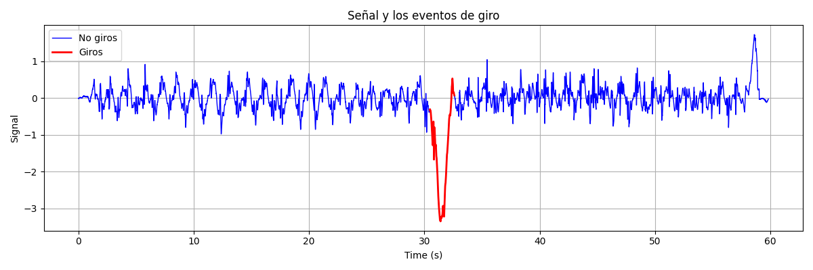 
  <strong>Figura:</strong> Gráfico de la componente vertical de la velocidad angular indicando con rojo los intervalos en los que se detectan giros. Registro <code>'MarchaEstandar_Rodrigo.txt'</code>

  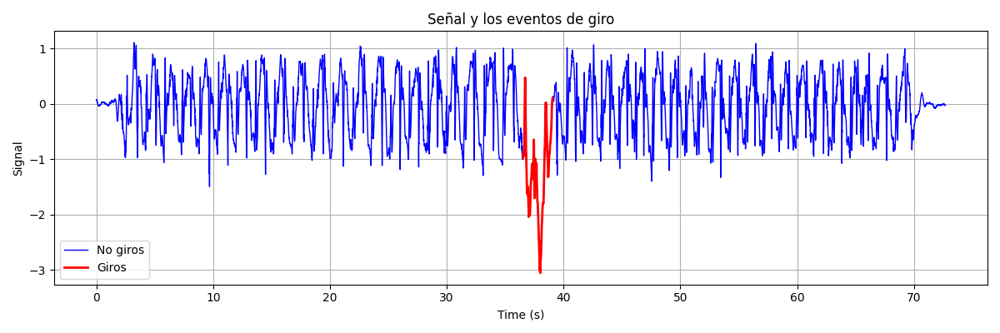 
  <strong>Figura:</strong> Gráfico de la componente vertical de la velocidad angular indicando con rojo los intervalos en los que se detectan giros. Registro <code>'MarchaEstandar_Sabrina.txt'</code>

  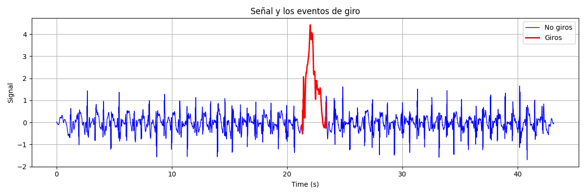 
  <strong>Figura:</strong> Gráfico de la componente vertical de la velocidad angular indicando con rojo los intervalos en los que se detectan giros. Registro <code>'MarchaLibre_Rodrigo.txt'</code>

   
  <strong>Figura:</strong> Gráfico de la componente vertical de la velocidad angular indicando con rojo los intervalos en los que se detectan giros. Registro <code>'MarchaLibre_Sabrina.txt'</code>

## ESTIMACIÓN DE PARÁMETROS CINEMÁTICOS DE LOS GIROS

### ÁNGULO DE ROTACIÓN

Dado que estamos estudiando las características de los giros mediante una única IMU ubicada en la espalda baja de la persona, el bias del giroscopio no es observable sin modificar algo en el setup. De esta manera, esta parte consiste en obtener la mejor estimación posible del ángulo de giro sin modificar nada sobre la implementación actual.

Para este fin voy a recurrir a la estimación de la orientación del sistema de la IMU con respecto al sistema inercial ENU/NED (definido en el pipeline) dada por una secuencia de cuaterniones que describen dicha orientación en el espacio:

$$
\{q_{i}:i=1,2,...,n\} \subset S^{3}
$$

siendo $S^{3}$ el espacio de los cuaterniones unitarios. Supongo que en la secuencia de marcha que estoy analizando tengo un total de $K$ giros detectados. Asigno entonces como notación a $q_{in}[k]$ y $q_{end}[k]$ a los cuaterniones que representan la orientación del sistema de la IMU con respecto al sistema inercial en los instantes iniciales y finales del giro $k$. Entonces yo calculo el cuaternión de rotación relativo entre los cuaterniones inicial y final asociados al giro obteniendo:

$$
q_{rel}[k] = q_{in}[k] ^ {*} \otimes q_{end}[k]
$$

Como paso siguiente, hago el cálculo del vector de rotación asociado al cuaternión relativo tomando el mapa logarítmico asociado a $q_{rel}[k]$ de modo que obtengo:

$$
u_{in}[k] = \text{Log}(q_{rel}[k])
$$

Dado que $u_{in}[k]$ está inicialmente expresado en la base del sistema del IMU en el instante inicial del giro (dado como hice la operación), lo que debo hacer es rotarla al sistema inercial antes de compararla con la aceleración gravitatoria, de modo que el vector de rotación expresado en la base inercial queda:

$$
u[k] = R_{in[k]}^{w} \left( u_{in}[k] \right)
$$

siendo $R_{in[k]}^{w}$ la matriz de rotación de la orientación del sistema de la IMU en el instante inicial de giro $k$ hacia el sistema inercial $w$. Dado que me interesa estimar el ángulo de giro en el plano horizontal, lo que hago es proyectar dicho vector de rotación en la dirección de la gravedad, que es $(0,0,1)$ dado que tanto ENU como NED comparten el hecho de que la gravedad está en la coordenada z. Esto es equivalente a quedarme con la tercera coordenada del vector de rotación $u[k]$. Esto queda que:

$$
\Delta \theta_{z}[k]= u_{z}[k]
$$